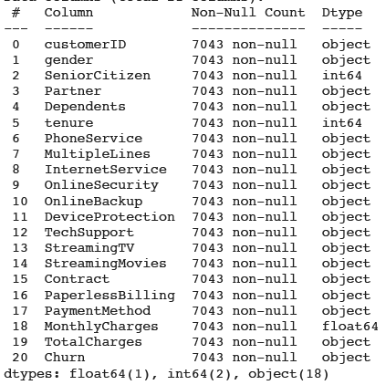
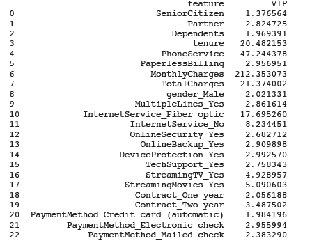
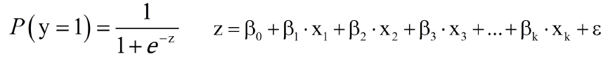

# Customer Churn Prediction

>see __German Version__ [below](#German_version)

  

## Business Understandig

__Corporation:__ na     
__Industry:__ Telecommunication  
__Area of Application:__ Churn Prediction  
__Business Objective:__ The estimation of the probability and whether a customer will churn or switch to a competitor and the recognition of which features lead to churn.  
__Description:__ Customer churn is a central problem for many subscription-based product or service offerings. This results from the fact that in these areas the costs of retaining an existing customer are far lower than the costs of acquiring entirely new customers. With this use case, the churn of a customer can be predicted so that appropriate measures can be taken at an early stage.  
__Solution:__ na  

## Data Unterstanding

__Data Frame:__ Telco-Customer-Churn    
__Source:__ Kaggle, „Telco Customer Churn“, 2019. https://www.kaggle.com/blastchar/telco-customer-churn  
__Data Creator:__ telecommunications company (Data set is maintained by IBM)   
__Date of Publication:__ 2019   
__Data Type:__ CSV    
__Description of Data Frame:__ The rows of the data set each represent one customer. The columns describe the characteristics or attributes of the customers. With the help of this data, an attempt is made to classify whether a customer leaves the company or not. For this purpose, the historical data contains the target variable "Churn", which provides information on whether a customer has left. The attributes are divided into three numerical features and 18 categorical features.  
__Number of Features:__ 21  
__Number of Targets:__ 1  
__Data Type per Feature:__ 

__Data Type per Target:__ object  
__Number of Observations:__ 7043  
__Location parameter:__    
__Distribution parameter:__    
__Correlation Analysis:__ The attributes "tenure" and "TotalCharges" show a high correlation of 0.8.  

## Data Preparation

__Dimensionality Reduction:__ Attributes that do not add value or are not significant removed  
__Outlier:__   
__Missing Data:__    
__Unbalanced Data:__     
__Data Conversion:__ Coding of the categorical features    
__Distribution Function:__ Similarity with an exponential distribution for the attribute "TotalCharges" recognizable.  

__Feature Scaling:__ StandardScaler   
__Multicollinearity:__   

## Modelling and Evaluation  

__Algorithms:__ Logistic regression    
__Hyperparameter:__ Threshold 0,3 in the second round     
__Output:__ supervised learning, classification  
__Data Split:__ 80% train data, 20% test data    
__Model Description:__ This problem case is a binary classification problem. A classical solution method for this type of problem is the so-called logistic regression. With the help of this, it is estimated with which probability of success P an event Y depends on the independent variables x1, ..., xk. Where the concrete values y = 0 for "not migrated" and y = 1 for "migrated" and x1, ..., xk for the individual attributes of the customers. Mathematically, the logistic function is used for this purpose:    

The formula shows the logistic function with the logit z. The logit is a regression model with the regression coefficient ßk, the error value ε and the independent variables xk.
The logit in combination with the logistic regression guarantees that according to the classification problem only function values between exactly 1 and 0 can be achieved. If the calculated result is greater than or equal to 0.5, then the predicted class is 1, if it is smaller than 0.5, the predicted class is 0. The closer the value is to 1, the higher the is the probability that the predicted result will occur. With a value of 0.8, the probability of class 1 occurring is exactly 80%, the occurrence of class 0 corresponds to the counter-event with a probability of of 20%. In terms of the application case, this means that a customer with specific given characteristics churns at 80% and the attribute Churn has to be assigned a predicted value of 1 must be assigned.    

__Evaluation Metrics Round1:__ Accuracy= 0.80, Recall= 0.53, precision= 0.68, AUC= 0.84      
__Evaluation Metrics Round2:__ Accuracy= 0.76, Recall= 0.73, precision= 0.53  

__Additional Information:__   

## Deployment

__Service:__    
__Target Group:__ Company with customer relationship (Telecommunication and other services)    
__Benefits:__ Prediction of possible customer churn in order to initiate the necessary measures to prevent customer churn.     
__Integration:__      

 

# Customer Churn Prediction (Deutschsprachige Version)  

## Geschäftsverständnis

__Konzern:__ na      
__Industrie:__ Telekommunikation  
__Anwendungsbereich:__ Customer Relationship Management  
__Unternehmensziel:__  Die Abschätzung der Wahrscheinlichkeit, ob ein Kunde abwandert oder zu einem Mitbewerber wechselt, und die Erkennung, welche Merkmale zur Abwanderung führen.    
__Beschreibung:__ Kundenabwanderung ist ein zentrales Problem für viele abonnementbasierte Produkt- oder Dienstleistungsangebote. Dies resultiert aus der Tatsache, dass in diesen Bereichen die Kosten für die Bindung eines bestehenden Kunden weitaus geringer sind als die Kosten für die Gewinnung völlig neuer Kunden. Mit diesem Anwendungsfall kann die Abwanderung eines Kunden vorhergesagt werden, so dass frühzeitig entsprechende Maßnahmen ergriffen werden können.    
__Lösung:__ na   

## Datenverständnis

__Datenrahmen:__ Telco-Customer-Churn      
__Quelle:__ Kaggle, „Telco Customer Churn“, 2019. https://www.kaggle.com/blastchar/telco-customer-churn       
__Datenersteller:__ Ein Telekommunikationsunternehmen (Der Datensatz wird von IBM verwaltet)       
__Veröffentlichungsdatum:__ 2019      
__Datentyp:__ CSV       
__Beschreibung des Datenrahmens:__ Die Zeilen des Datensatzes stellen jeweils einen Kunden dar. Die Spalten beschreiben die Merkmale oder Eigenschaften der Kunden. Mit Hilfe dieser Daten wird versucht zu klassifizieren, ob ein Kunde das Unternehmen verlässt oder nicht. Zu diesem Zweck enthalten die historischen Daten die Zielvariable "Churn", die Auskunft darüber gibt, ob ein Kunde abgewandert ist. Die Attribute sind in drei numerische Merkmale und 18 kategoriale Merkmale unterteilt.    
__Anzahl der Attribute:__ 21  
__Anzahl der Zielvariablen:__ 1  
__Datentyp pro Attribut:__    

__Datentyp pro Zielvariable:__ object    
__Anzahl der Beobachtungen:__ 7043  
__Standortparameter:__    
__Verteilungsparameter:__    
__Korrelationsanalyse:__ Die Attribute "tenure" und "TotalCharges" weisen eine hohe Korrelation von 0,8 auf.        

## Datenaufbereitung

__Dimensionsreduktion:__ Attribute, die keinen Mehrwert bieten oder nicht signifikant sind, werden entfernt.     
__Ausreißer:__  
__Fehlende Daten:__  
__Unausgeglichene Daten:__  
__Datenkonvertierung:__ Kodierung der kategorialen Merkmale.    
__Verteilungsfunktion:__ Ähnlichkeit mit einer Exponentialverteilung für das Attribut "TotalCharges" erkennbar.  

__Funktionsskalierung:__    
__Multikollinearität:__  

## Modellierung und Auswertung

__Algorithmen:__ Logistische Regression    
__Hyperparameter:__ Threshold von 0,3 in der zweiten Runde  
__Ausgabe:__ Überwachtes Lernen, Klassifikation   
__Datenaufteilung:__ 80% Trainingsdaten, 20% Testdaten     
__Modellbeschreibung:__ Bei diesem Problemfall handelt es sich um ein binäres Klassifikationsproblem. Ein klassisches Lösungsverfahren für diese Art von Problemen ist die sogenannte logistische Regression. Mit Hilfe dieser wird geschätzt, mit welcher Erfolgswahrscheinlichkeit P ein Ereignis Y von den unabhängigen Variablen x1, ..., xk abhängt. Dabei stehen die konkreten Werte y = 0 für "nicht abgewandert" und y = 1 für "abgewandert" und x1, ..., xk für die einzelnen Merkmale der Kunden. Mathematisch wird hierfür die logistische Funktion verwendet:    

  

Die Formel zeigt die logistische Funktion mit dem Logit z. Der Logit ist ein Regressionsmodell mit dem Regressionskoeffizienten ßk, dem Fehlerwert ε und den unabhängigen Variablen xk.
Der Logit in Kombination mit der logistischen Regression gewährleistet, dass je nach Klassifikationsproblem nur Funktionswerte zwischen genau 1 und 0 erreicht werden können. Ist das berechnete Ergebnis größer oder gleich 0,5, so ist die vorhergesagte Klasse 1, ist es kleiner als 0,5, so ist die vorhergesagte Klasse 0. Je näher der Wert an 1 liegt, desto höher ist die Wahrscheinlichkeit, dass das vorhergesagte Ergebnis eintritt. Bei einem Wert von 0,8 beträgt die Wahrscheinlichkeit des Eintretens der Klasse 1 genau 80%, das Eintreten der Klasse 0 entspricht dem Gegenereignis mit einer Wahrscheinlichkeit von 20%. Bezogen auf den Anwendungsfall bedeutet dies, dass ein Kunde mit bestimmten vorgegebenen Merkmalen zu 80% abwandert und dem Attribut Abwanderung ein Vorhersagewert von 1 zugewiesen werden muss.   
  
__Bewertungsmetriken Runde1:__ Accuracy= 0.80, Recall= 0.53, precision= 0.68, AUC= 0.84    
__Bewertungsmetriken Runde2:__ Accuracy= 0.76, Recall= 0.73, precision= 0.53  

__Weitere Informationen:__    

## Bereitstellung  

__Service:__    
__Zielgruppe:__ Unternehmen mit Kundenbindung (Telekommunikation oder andere Services die angeboten werden)     
__Leistungen:__ Vorhersage einer möglichen Kundenabwanderung, um frühzeitig Maßnahmen einzuleiten, die die Abwanderung verhindern können.     
__Integration:__    
