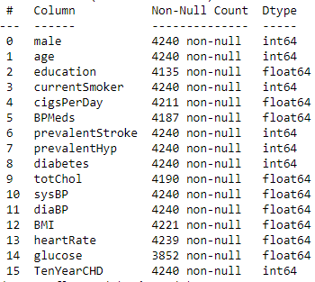

# Risk prediction coronary heart disease
>see __German Version__ [below](#German_version)

  

## Business Understandig

__Corporation:__ na     
__Industry:__ Medicine  
__Area of Application:__ Risk prediction   
__Business Objective:__ What prediction of a risk of developing coronary heart disease based on different demographic, behavioral, and medical factors can be determined?    
__Description:__ With the prediction of the risk of coronary heart disease, early measures can be taken for the patient to avoid the later disease in the best case.   
__Solution:__ no prediction         

## Data Unterstanding

__Data Frame:__ framingham    
__Source:__ Kaggle, https://www.kaggle.com/amanajmera1/framingham-heart-study-dataset    
__Data Creator:__ na       
__Date of Publication:__ 2017       
__Data Type:__ CSV    
__Description of Data Frame:__  The dataset is from the ongoing Framingham Cardiovascular Heart Study which is publicly available in Kaggle. The dataset contains 4,240 records with a total of 16 attributes. These attributes are divided into demographic, behavioral, and medical risk factors.   
__Number of Features:__ 16     
__Number of Targets:__ 1     
__Data Type per Feature:__ 

__Data Type per Target:__ int      
__Number of Observations:__ 4240      
__Location parameter:__    
__Distribution parameter:__    
__Correlation Analysis:__ There is a correlation between "currentSmoker" and "cigsPerDay", and between "sysBP" and "diaBP".      

## Data Preparation

__Dimensionality Reduction:__ Attributes that do not add value or are not significant removed (like education, cigsPerDay and diaBP)       
__Outlier:__ Outliers are removed     
__Missing Data:__ Rows with missing data are removed      
__Unbalanced Data:__ Undersampling performed    
__Data Conversion:__          
__Distribution Function:__ na    

__Feature Scaling:__ StandardScaler     
__Multicollinearity:__ Tests are performed      

## Modelling and Evaluation  

__Algorithms:__ Logistic regression    
__Hyperparameter:__       
__Output:__ supervised learning, classification     
__Data Split:__ 80% train data, 20% test data       
__Model Description:__ The collected data is split into two parts - a training dataset and a test dataset. The test data set is used to validate the effectiveness of the algorithm. It is used to test the final model against unknown data with which it has not been trained.      

__Evaluation Metrics:__ Accuracy= 0.86      

__Additional Information:__     

## Deployment   

__Service:__    
__Target Group:__ Fields of medicine dealing with heart diseases         
__Benefits:__ Early detection of disease risk    
__Integration:__          

 

# Risk prediction coronary heart disease (Deutschsprachige Version)  

## Geschäftsverständnis

__Unternehmen:__ na     
__Branche:__ Medizin  
__Anwendungsbereich:__ Risikovorhersage   
__Geschäftsziel:__ Wie lässt sich das Risiko, eine koronare Herzkrankheit zu entwickeln, auf der Grundlage verschiedener demografischer, verhaltensbezogener und medizinischer Faktoren vorhersagen?    
__Beschreibung:__ Mit der Vorhersage des Risikos einer koronaren Herzkrankheit können frühzeitig Maßnahmen für den Patienten ergriffen werden, um die spätere Erkrankung im besten Fall zu vermeiden.   
__Lösung:__ keine Vorhersage         

## Datenverständnis

__Datenrahmen:__ framingham    
__Quelle:__ Kaggle, https://www.kaggle.com/amanajmera1/framingham-heart-study-dataset    
__Datenersteller:__ na       
__Datum der Veröffentlichung:__ 2017       
__Datentyp:__ CSV    
__Beschreibung des Datenrahmens:__ Der Datensatz stammt aus der laufenden Framingham Cardiovascular Heart Study, die in Kaggle öffentlich zugänglich ist. Der Datensatz enthält 4.240 Datensätze mit insgesamt 16 Attributen. Diese Attribute sind in demografische, verhaltensbezogene und medizinische Risikofaktoren unterteilt.   
__Anzahl der Merkmale:__ 16     
__Anzahl der Ziele:__ 1     
__Datentyp pro Merkmal:__ 

__Datentyp pro Ziel:__ int      
__Anzahl der Beobachtungen:__ 4240      
__Parameter "Ort":__    
__Verteilungsparameter:__    
__Korrelationsanalyse:__ Es besteht eine Korrelation zwischen "currentSmoker" und "cigsPerDay" sowie zwischen "sysBP" und "diaBP".      

## Datenaufbereitung

__Dimensionalitätsreduktion:__ Attribute, die keinen Wert hinzufügen oder nicht signifikant sind, werden entfernt (wie Bildung, cigsPerDay und diaBP)       
__Ausreißer:__ Ausreißer werden entfernt     
__Fehlende Daten:__ Zeilen mit fehlenden Daten werden entfernt      
__Unausgewogene Daten:__ Undersampling durchgeführt    
__Datenkonvertierung:__ Datenkonvertierung:__          
__Verteilungsfunktion:__ na    

__Merkmalsskalierung:__ StandardSkalierung     
__Multikollinearität:__ Tests werden durchgeführt      

## Modellierung und Auswertung  

__Algorithmen:__ Logistische Regression    
__Hyperparameter:__       
__Output:__ überwachtes Lernen, Klassifikation     
__Datenaufteilung:__ 80% Trainingsdaten, 20% Testdaten       
__Modellbeschreibung:__ Die gesammelten Daten werden in zwei Teile aufgeteilt - einen Trainingsdatensatz und einen Testdatensatz. Der Testdatensatz wird verwendet, um die Wirksamkeit des Algorithmus zu überprüfen. Er wird verwendet, um das endgültige Modell mit unbekannten Daten zu testen, mit denen es nicht trainiert wurde.      

__Evaluierungsmetriken:__ Genauigkeit= 0,86      

__Zusätzliche Informationen:__     

## Einsatz   

__Dienst:__    
__Zielgruppe:__ Medizinische Fachbereiche, die sich mit Herzkrankheiten beschäftigen         
__Nutzen:__ Früherkennung von Krankheitsrisiken    
__Integration:__
