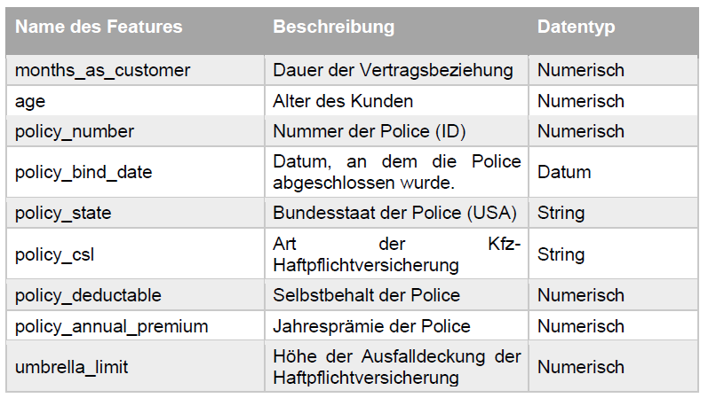
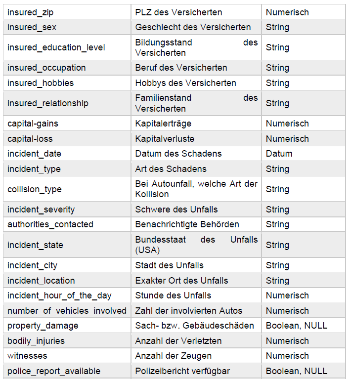
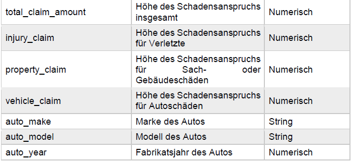
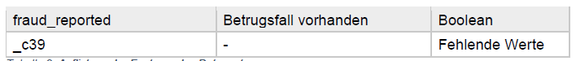
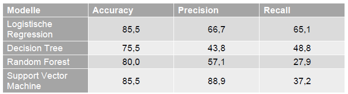

# Insurance Fraud detection

>see __German Version__ [below](#German_version)

  

## Business Understandig

__Corporation:__ na     
__Industry:__ Insurance  
__Area of Application:__ Fraud detection  
__Business Objective:__  Through this service, future insurance fraudsters can be detected ahead of time.  
__Description:__  The insurance industry has always generated a large amount of data, be it the very personal data of policyholders, statistics on the performance of insurance products, or quite normal business metrics such as revenue, profit, and costs. The insurance sector is therefore predestined for the application of machine learning. At the same time, insurance companies are very popular targets for fraudsters. This can happen in the form of hacker attacks or quite analogously as insurance fraud, for example, in the case of a supposed claim. Since the insurance principle applies to insurance, all insured parties pay in the event of fraud. It harms the entire community. It is therefore particularly important to recognize and prevent fraud.   
__Solution:__ na    

## Data Unterstanding

__Data Frame:__ Auto Insurance Claims Data      
__Source:__ Kaggle, „Auto Insurance Claims Data“, https://kaggle.com/buntyshah/auto-insurance-claims-data      
__Data Creator:__ na   
__Date of Publication:__ 2019    
__Data Type:__ CSV      
__Description of Data Frame:__ The data set used consists of 1000 sentences and has 40 different so-called features, i.e. collected data categories. This means that the data basis is not that large, but the possibilities to examine different features are all the greater. It shows information on policyholders, on the policy data of the insured and their motor vehicles, as well as on accidents and the amount of damage. The target variable shows whether insurance fraud is present ("fraud_reported"). The dataset is a good example of classification models because of the binary target variable (later also called target).  
__Number of Features:__ 40   
__Number of Targets:__ 1    
__Data Type per Feature:__ 

__Number of Observations:__ 1000        
__Location parameter:__       
__Distribution parameter:__       
__Correlation Analysis:__ There is a high correlation for age and months_as_customer as well as for total_claim_amount and vehicle_claim. In addition, there is a somewhat lower correlation of 0.81 between total_claim_amount and each of property_claim and injury_claim.       

## Data Preparation

__Dimensionalitätsreduktion:__ Attribute, die keinen Mehrwert bringen oder nicht signifikant sind, werden entfernt   
__Ausreißer:__        
__Fehlende Daten:__ Spalten mit fehlenden Daten werden entfernt            
__Unausgewogene Daten:__             
__Datenkonvertierung:__         
__Verteilungsfunktion:__        

__Merkmalsskalierung:__          
__Multikollinearität:__          

## Modelling and Evaluation  

__Algorithms:__ Logistic regression, decision trees, Random forest,  Support Vector Machine    
__Hyperparameter:__ na    
__Output:__ supervised learning, classification      
__Data Split:__ 80% train data, 20% test data       
__Model Description:__ Classification models are diverse and include, for example, Logistic Regression, Decision Tree, Random Forest and Support Vector Machines. All of the above models were tested on the data set.    

__Evaluation Metrics:__   

     

__Additional Information:__       

## Deployment

__Service:__         
__Target Group:__ Insurance companies      
__Benefits:__ Early prediction of potential insurance fraud.    
__Integration:__          

 

# Insurance Fraud detection (Deutschsprachige Version)      

## Geschäftsverständnis

__Konzern:__ na        
__Branche:__ Versicherung    
__Anwendungsbereich:__ Betrugserkennung      
__Geschäftsziel:__ Durch diesen Dienst können zukünftige Versicherungsbetrüger frühzeitig erkannt werden.      
__Beschreibung:__ Die Versicherungsbranche generiert seit jeher eine große Menge an Daten, seien es die sehr persönlichen Daten der Versicherungsnehmer, Statistiken über die Leistung von Versicherungsprodukten oder ganz normale Geschäftskennzahlen wie Umsatz, Gewinn und Kosten. Der Versicherungssektor ist daher prädestiniert für die Anwendung von maschinellem Lernen. Gleichzeitig sind Versicherungsunternehmen sehr beliebte Ziele für Betrüger. Dies kann in Form von Hackerangriffen geschehen oder ganz analog als Versicherungsbetrug, zum Beispiel bei einem vermeintlichen Schadensfall. Da bei Versicherungen das Versicherungsprinzip gilt, zahlen im Falle eines Betrugs alle Versicherten. Er schadet der gesamten Gemeinschaft. Deshalb ist es besonders wichtig, Betrug zu erkennen und zu verhindern.      
__Lösung:__ na        

## Datenverständnis

__Datenrahmen:__ Auto Insurance Claims Data       
__Quelle:__ Kaggle, "Auto Insurance Claims Data", https://kaggle.com/buntyshah/auto-insurance-claims-data        
__Datenersteller:__ na     
__Datum der Veröffentlichung:__ 2019      
__Datentyp:__ CSV         
__Description of Data Frame:__ Der verwendete Datensatz besteht aus 1000 Sätzen und hat 40 verschiedene sogenannte Features, d.h. gesammelte Datenkategorien. Das bedeutet, dass die Datenbasis nicht sehr groß ist, dafür sind die Möglichkeiten, verschiedene Merkmale zu untersuchen, umso größer. Sie zeigt Informationen zu den Versicherungsnehmern, zu den Versicherungsdaten der Versicherten und ihrer Kraftfahrzeuge sowie zu Unfällen und Schadenshöhen. Die Zielvariable zeigt an, ob ein Versicherungsbetrug vorliegt ("fraud_reported"). Der Datensatz ist aufgrund der binären Zielvariable (später auch Ziel genannt) ein gutes Beispiel für Klassifikationsmodelle.      
__Anzahl der Merkmale:__ 40      
__Anzahl der Ziele:__ 1       
__Datentyp pro Merkmal:__ 

    

__Anzahl der Beobachtungen:__ 1000            
__Verteilungsparameter:__    
__Korrelationsanalyse:__ Eine hohe Korrelation besteht für Alter und Monate_als_Kunde sowie für Gesamtschadensumme und Fahrzeugschaden. Darüber hinaus besteht eine etwas geringere Korrelation von 0,81 zwischen Gesamtschadensumme und jeweils Sachschaden und Personenschaden.           

## Datenaufbereitung

__Dimensionsreduktion:__ Attribute, die keinen Mehrwert bieten oder nicht signifikant sind, werden entfernt.     
__Ausreißer:__  
__Fehlende Daten:__  
__Unausgeglichene Daten:__  
__Datenkonvertierung:__ Kodierung der kategorialen Merkmale.    
__Verteilungsfunktion:__ Ähnlichkeit mit einer Exponentialverteilung für das Attribut "TotalCharges" erkennbar.  

__Funktionsskalierung:__    
__Multikollinearität:__       

__Algorithmen:__ Logistische Regression, Entscheidungsbäume, Random Forest, Support Vector Machine      
__Hyperparameter:__ na      
__Ausgabe:__ Überwachtes Lernen, Klassifikation        
__Datenaufteilung:__ 80% Trainingsdaten, 20% Testdaten          
__Modellbeschreibung:__ Klassifizierungsmodelle sind vielfältig und umfassen zum Beispiel logistische Regression, Entscheidungsbaum, Random Forest und Support Vector Machines. Alle oben genannten Modelle wurden mit dem Datensatz getestet.       

__Auswertungsmetriken:__       

     

__Zusätzliche Informationen:__       

## Bereitstellung  

__Dienstleistung:__            
__Zielgruppe:__ Versicherungsgesellschaften         
__Vorteile:__ Frühzeitige Vorhersage von potenziellem Versicherungsbetrug.       
__Integration:__        
