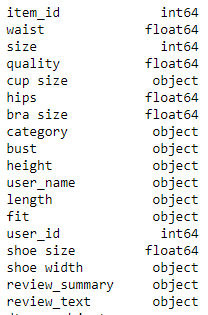

# Confetion size prediction for online stores    
>see __German Version__ [below](#German_version)

  

## Business Understandig

__Corporation:__ na     
__Industry:__ Fashion     
__Area of Application:__ Warehouse     
__Business Objective:__ Prediction of the right size to avoid unnecessary returns.     
__Description:__ Ordering clothes in different sizes and the associated returns, cost the company an unnecessary amount of money. The goal is to enable the prediction of the appropriate size by using various factors from customer reviews in ML approaches.    
__Solution:__ order different sizes      

## Data Unterstanding

__Data Frame:__ renttherunway_final_data        
__Source:__ https://www.kaggle.com/rmisra/clothing-fit-dataset-for-size-recommendation?select=renttherunway_final_data.json     
__Data Creator:__ ModCloth, Online-Shops for women          
__Date of Publication:__ 2018       
__Data Type:__ json        
__Description of Data Frame:__ The dataset contains information from the customer reviews that may have an impact on the fitting size. This includes, for example, bra size, height, weight, fit feedback, etc.    
__Number of Features:__ 18       
__Number of Targets:__           
__Data Type per Feature:__      

__Data Type per Target:__ integer      
__Number of Observations:__ 82413       
__Location parameter:__         
__Distribution parameter:__            
__Correlation Analysis:__ Waist & Bra size: 0.8, Bra size & size: 0.8, Hips & size: 0.7, Hips & bra size: 0.7    

## Data Preparation

__Dimensionality Reduction:__ Deleted due to not needed: user_id, user_name, item_id, review_text, review_summary, shoe width, shoe size, waist, bust, quality and length.       
__Outlier:__         
__Missing Data:__ Rows with missing data are removed       
__Unbalanced Data:__         
__Data Conversion:__ Discretization (fit) and dummy variable introduced         
__Distribution Function:__        

__Feature Scaling:__ StandardScaler   
__Multicollinearity:__           

## Modelling and Evaluation  

__Algorithms:__ Logistic regression    
__Hyperparameter:__           
__Output:__ supervised learning, classification  
__Data Split:__ 80% train data, 20% test data    
__Model Description:__ In the modeling phase, a decision was first made between the target and the features. Then the data was split into training and test data and the features were scaled from the two data sets. Linear regression was used as the algorithm.    

__Evaluation Metrics:__ Train performance: 0.73, test performance: 0.73      

__Additional Information:__   

## Deployment

__Service:__    
__Target Group:__ Online Shops         
__Benefits:__ Avoidance of returns and associated costs      
__Integration:__ Customer should be able to specify certain data in the online store and get a good prediction about the right size based on it.         

 

# Confetion size prediction for online stores (Deutschsprachige Version)  

## Geschäftsverständnis

__Unternehmen:__ na     
__Branche:__ Mode     
__Anwendungsbereich:__ Warehouse     
__Unternehmensziel:__ Vorhersage der richtigen Größe zur Vermeidung unnötiger Retouren.     
__Beschreibung:__ Die Bestellung von Kleidung in unterschiedlichen Größen und die damit verbundenen Retouren kosten das Unternehmen unnötig viel Geld. Ziel ist es, die Vorhersage der passenden Größe durch die Verwendung verschiedener Faktoren aus Kundenrezensionen in ML-Ansätzen zu ermöglichen.    
__Lösung:__ verschiedene Größen bestellen      

## Datenverständnis

__Datenrahmen:__ renttherunway_final_data        
__Quelle:__ https://www.kaggle.com/rmisra/clothing-fit-dataset-for-size-recommendation?select=renttherunway_final_data.json     
__Datenersteller:__ ModCloth, Online-Shops für Frauen          
__Datum der Veröffentlichung:__ 2018       
__Datentyp:__ json        
__Beschreibung des Datenrahmens:__ Der Datensatz enthält Informationen aus den Kundenrezensionen, die einen Einfluss auf die Anprobegröße haben können. Dazu gehören z.B. BH-Größe, Größe, Gewicht, Passform-Feedback, etc.    
__Anzahl der Merkmale:__ 18       
__Anzahl der Ziele:__           
__Datentyp pro Merkmal:__      

__Datentyp pro Ziel:__ ganze Zahl      
__Anzahl der Beobachtungen:__ 82413       
__Parameter_Standort:__         
__Verteilungsparameter:__            
__Korrelationsanalyse:__ Taille & BH-Größe: 0.8, BH-Größe & Größe: 0.8, Hüfte & Größe: 0.7, Hüfte & BH-Größe: 0.7    

## Datenaufbereitung

__Dimensionalitätsreduktion:__ Gelöscht, weil nicht benötigt: user_id, user_name, item_id, review_text, review_summary, Schuhweite, Schuhgröße, Taille, Oberweite, Qualität und Länge.       
__Ausreißer:__         
__Fehlende Daten:__ Zeilen mit fehlenden Daten werden entfernt.       
__Unausgewogene Daten:__         
__Datenkonvertierung:__ Diskretisierung (Fit) und Dummy-Variable eingeführt         
__Verteilungsfunktion:__        

__Merkmalsskalierung:__ StandardSkalierer   
__Multikollinearität:__           

## Modellierung und Auswertung  

__Algorithmen:__ Logistische Regression    
__Hyperparameter:__           
__Output:__ überwachtes Lernen, Klassifikation  
__Datenaufteilung:__ 80% Trainingsdaten, 20% Testdaten    
__Modellbeschreibung:__ In der Modellierungsphase wurde zunächst eine Entscheidung zwischen dem Ziel und den Merkmalen getroffen. Dann wurden die Daten in Trainings- und Testdaten aufgeteilt und die Merkmale wurden aus den beiden Datensätzen skaliert. Als Algorithmus wurde die lineare Regression verwendet.    

__Evaluationsmetriken:__ Train performance: 0.73, Testleistung: 0.73      

__Weitere Informationen:__        

## Einsatz

__Dienst:__    
__Zielgruppe:__ Online-Shops         
__Vorteile:__ Vermeidung von Retouren und damit verbundenen Kosten      
__Integration:__ Der Kunde soll im Online-Shop bestimmte Daten angeben können und darauf basierend eine gute Vorhersage über die richtige Größe erhalten.
