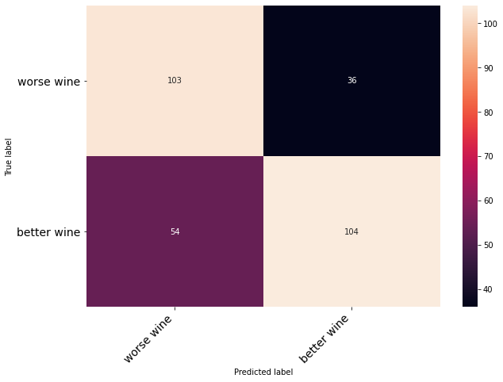

# What Quality does the Red wine have
>see __German Version__ [below](#German_version)

  

## Business Understanding
A winery wants to make sure it always produces high Quality and tasty wine.
They employ professional wine tasters to test all new batches of wine.
These Professionals then rate the wine on a scale from 1 to 10.
But this process is expensive and subjective.
The wine manufactory would like to use a machine learning model in order to generate predictions about quality.
The ultimate goal is to develop a model 
that automatically categorizes new wine batches based on its chemical attributes. 

__Corporation:__   na  
__Industry:__   Wine  
__Area of Application:__   Taste Assessment  
__Business Objective:__   Differentiate bad and good Wine efficiently  

## Data Unterstanding
The dataset named "Wine Quality Data Set" has been extracted from the UCI website 
and gives us real data for our wine manufactory. The data 
were collected in 2009 and come from Northern Portugal. The data set has 
entries for red and white wines. The dataset of the 
red wines thus has 12 columns and 1600 entries. The columns are 
named after the ingredients and the quality of a red wine in table 1.  
__Data Frame:__    Wine Quality Data Set  
__Source:__  https://archive.ics.uci.edu/ml/datasets.php  
__Data Creator:__  https://archive.ics.uci.edu/ml/datasets.php  
__Date of Publication:__  2009-10-07  
__Data Type:__   csv  
__Description of Data Frame:__  Two datasets are included, related to red and white vinho verde wine samples, from the north of Portugal. The goal is to model wine quality based on physicochemical tests (see [Cortez et al., 2009], [Web Link](http://www3.dsi.uminho.pt/pcortez/wine/) ).  
__Number of Features:__  12  
__Number of Observations:__  4898  

| Feature  | Data Type|
|-----|------|
|fixed acidity       |   float64  |
|volatile acidity    |   float64  |
|citric acid         |   float64  |
|residual sugar      |   float64  |
|chlorides           |   float64  |
|free sulfur dioxide |   float64  |
|total sulfur dioxide|   float64  |
|density             |   float64  |
|pH                  |   float64  |
|sulphates           |   float64  |
|alcohol             |   float64  |
|quality             |   int64    |

## Data Preparation

__Dimensionality Reduction:__    remove duplicates  
__Outlier:__  remove outliers on multiple features using .quantile(98)  
__Missing Data:__  None  
__Unbalanced Data:__  Transform Target Variable into binary classifier  
__Data Conversion:__  
__Distribution Function:__  
__Feature Scaling:__  use sklearn StandardScaler to Transform the data   
__Multicollinearity:__  remove fixed acidity, as it is highly correlated with pH  

## Modelling and Evaluation

__Algorithms:__  LinearRegression, LogisticRegression, Tensorflow Neural Network   
__Hyperparameter:__  None  
__Output:__  is this a good or a bad wine
__Data Split:__  test dataset = 20%  
__Model Description:__  classify if a wine is above or below average quality  
__Evaluation Metrics:__  metric for Neural Network  
  
__Additional Information:__  

## Deployment

To use this trained ML model, an API has to be created.  
The goal is, that you can access the ML model with an API request over the internet. (Or your intranet)  
The code for the deployment can be found here.  https://github.com/Dustin-dusTir/ml-services-api  
maybe there is still a live version of the api and the Frontend running.  

__Service:__  The ML model can be deployed on a machine in the wine manufacturing facility. The wine maker takes a probe and analysis its chemical components. This data can then be fed into the ML Algorithm.   
__Benefits:__  Get cheap and instant feedback on the wine quality

 

# Welche Qualität hat der Rotwein? (Deutschsprachige Version)  

## Geschäftsverständnis
Vor einigen Monaten hat die Weinmanufaktur neue Flächen für ihrer Weinreben
gekauft und hat nun daraus ihre ersten Rotweine produziert. Durch die neuen 
Flächen erhofft sich die Weinmanufaktur weiterhin eine hohe Qualität und 
Zufriedenheit bei ihren Kunden. Deshalb hat die Weinmanufaktur nach einer großen 
Befragung ausgerufen, wo diverse Kunden und Weinkritiker die Rotweine nach dem 
Geschmack benoten sollen. Die Bewertungsskala definiert sich in 0 für einen sehr 
schlechten Rotwein und 10 für einen sehr guten Rotwein. Ziel der gesamten 
Befragung ist es die Qualität der Rotweine aus den bereits bestehenden Rezepturen 
der Weine zu überprüfen. Da die Weinmanufaktur auch in Sachen Digitalisierung 
mitreden möchte, möchte sie gerne ein Machine Learning Modell einsetzen, um 
Vorherzusagen zur Qualität zu generieren. Am Ende soll ein Modell entwickelt 
werden, dass neue Rezepturen automatisch auf Basis der Befragung kategorisiert
und die Weinmanufaktur schnell auf die Qualität, Inhaltstoffe oder andere Dinge 
reagieren kann.
__Konzern:__  
__Industrie:__  
__Anwendungsbereich:__  
__Unternehmensziel:__  
__Beschreibung:__  
__Lösung:__  

## Datenverständnis
Der Datensatz mit dem Namen „Wine Quality Data Set“ wurde aus der UCI Webseite 
gezogen und gibt uns annähernd reale Daten für unsere Weinmanufaktur. Die Daten 
wurden im Jahr 2009 erfasst und stammen aus Nordportugal. Der Datensatz verfügt 
über Einträge zu Rot- und Weißweinen. In unserem Anwendungsfall möchte die 
Weinmanufaktur Stuttgart nur die Rotweine in Betracht ziehen. Der Datensatz der 
Rotweine verfügt somit über 12 Spalten und 1600 Einträgen. Die Spalten sind 
benannt nach den Inhaltstoffen und der Qualität eines Rotweines in Tabelle 1.  

__Datenrahmen:__  
__Quelle:__  
__Datenersteller:__  
__Veröffentlichungsdatum:__  
__Datentyp:__   
__Beschreibung des Datenrahmens:__  
__Anzahl der Funktionen:__  
__Anzahl der Ziele:__  
__Datentyp pro Funktion:__  
__Datentyp pro Ziel:__  
__Anzahl der Beobachtungen:__  
__Standortparameter:__  
__Verteilungsparameter:__  
__Korrelationsanalyse:__  

## Datenaufbereitung

__Dimensionsreduktion:__  
__Ausreißer:__  
__Fehlende Daten:__  
__Unausgeglichene Daten:__  
__Datenkonvertierung:__  
__Verteilungsfunktion:__  
__Funktionsskalierung:__  
__Multikollinearität:__  

## Modellierung und Auswertung

__Algorithmen:__  
__Hyperparameter:__  
__Ausgabe:__  
__Datenaufteilung:__  
__Modellbeschreibung:__  
__Bewertungsmetriken:__  
__Weitere Informationen:__  

## Bereitstellung

__Service:__  
__Zielgruppe:__  
__Leistungen:__  
__Integration:__  
