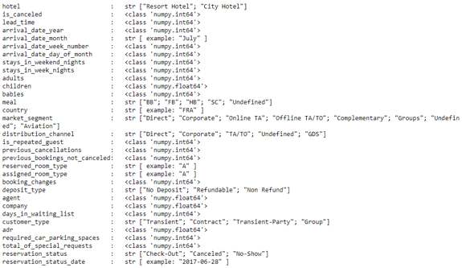

# Hotel booking cancellation prediction   
>see __German Version__ [below](#German_version)

  

## Business Understandig

__Corporation:__ na     
__Industry:__ Hotel    
__Area of Application:__ Sales           
__Business Objective:__ Prediction of booking cancellation        
__Description:__ The use case is intended to test whether it is possible to predict hotel cancellations.     
__Solution:__ no prediction          

## Data Unterstanding

__Data Frame:__ Hotel_bookings        
__Source:__ Kaggle, https://www.kaggle.com/jessemostipak/hotel-booking-demand     
__Data Creator:__ Nuno Antonio, Ana Almeida, Luis Nunes    
__Date of Publication:__ 2019      
__Data Type:__ CSV    
__Description of Data Frame:__ The data frame includes booking information from two different hotels.   
__Number of Features:__ 32       
__Number of Targets:__ 1      
__Data Type per Feature:__ 

__Data Type per Target:__        
__Number of Observations:__ 119390  
__Location parameter:__     
__Distribution parameter:__        
__Correlation Analysis:__ stays_in_weekend_nights and stays_in_week_night with 0.5.      

## Data Preparation

__Dimensionality Reduction:__ removed attributes with no description      
__Outlier:__      
__Missing Data:__ rows with missing data are removed       
__Unbalanced Data:__      
__Data Conversion:__ Dummy variables are created        
__Distribution Function:__       

__Feature Scaling:__        
__Multicollinearity:__      

## Modelling and Evaluation  

__Algorithms:__ Logistic regression, DecisionTree, Random Forest        
__Hyperparameter:__          
__Output:__ supervised learning, classification      
__Data Split:__ 80% train data, 20% test data         
__Model Description:__ The dataset is uploaded with its dummy variables and divided into a training and testing set. Then the training and testing process is performed and evaluated with 3 different algorithms.        

__Evaluation Metrics DecisionTree:__ Accuracy= 0.82, Recall= 0.74, precision= 0.76        
__Evaluation Metrics Logistic regression:__ Accuracy= 0.78, Recall= 0.55, precision= 0.78     
__Evluation Metrics Random Forest:__ Accuracy= 0.82, Recall= 0.57, precision= 0,90     

__Additional Information:__   

## Deployment

__Service:__    
__Target Group:__ Hotels      
__Benefits:__ Estimation of customer behavior regarding hotel cancellations for the scheduling of capacities.      
__Integration:__          

 

# Hotel booking cancellation prediction (Deutschsprachige Version)  

## Geschäftsverständnis

__Unternehmen:__ na     
__Branche:__ Hotel    
__Anwendungsbereich:__ Vertrieb           
__Geschäftsziel:__ Vorhersage von Buchungsstornierungen        
__Beschreibung:__ Der Anwendungsfall soll testen, ob es möglich ist, Hotelstornierungen vorherzusagen.     
__Lösung:__ keine Vorhersage          

## Datenverständnis

__Datenrahmen:__ Hotel_Buchungen        
__Quelle:__ Kaggle, https://www.kaggle.com/jessemostipak/hotel-booking-demand     
__Datenersteller:__ Nuno Antonio, Ana Almeida, Luis Nunes    
__Datum der Veröffentlichung:__ 2019      
__Datentyp:__ CSV    
__Beschreibung des Datenrahmens:__ Der Datenrahmen enthält Buchungsinformationen von zwei verschiedenen Hotels.   
__Anzahl der Merkmale:__ 32       
__Anzahl der Ziele:__ 1      
__Datentyp pro Merkmal:__ 

__Datentyp pro Ziel:__        
__Anzahl der Beobachtungen:__ 119390  
__Standort-Parameter:__     
__Verteilungsparameter:__        
__Korrelationsanalyse:__ Aufenthalte_am_Wochenende_Nächte und Aufenthalte_in_der_Woche_Nacht mit 0.5.      

## Datenaufbereitung

__Dimensionalitätsreduktion:__ entfernte Attribute ohne Beschreibung      
__Ausreißer:__      
__Fehlende Daten:__ Zeilen mit fehlenden Daten werden entfernt       
__Unausgewogene Daten:__      
__Datenkonvertierung:__ Dummy-Variablen werden erstellt        
__Verteilungsfunktion:__           

__Merkmalsskalierung:__        
__Multikollinearität:__      

## Modellierung und Auswertung  

__Algorithmen:__ Logistische Regression, Entscheidungsbaum, Random Forest        
__Hyperparameter:__          
__Output:__ überwachtes Lernen, Klassifikation      
__Datenaufteilung:__ 80% Trainingsdaten, 20% Testdaten         
__Modellbeschreibung:__ Der Datensatz wird mit seinen Dummy-Variablen hochgeladen und in einen Trainings- und einen Testsatz aufgeteilt. Dann wird der Trainings- und Testprozess mit 3 verschiedenen Algorithmen durchgeführt und ausgewertet.        

__Auswertungsmetriken DecisionTree:__ Genauigkeit= 0.82, Rückruf= 0.74, Präzision= 0.76        
__Auswertungsmetriken Logistische Regression:__ Genauigkeit= 0.78, Rückruf= 0.55, Präzision= 0.78     
__Auswertungsmetriken Random Forest:__ Genauigkeit= 0.82, Rückruf= 0.57, Genauigkeit= 0,90     

__Zusätzliche Informationen:__   

## Einsatz

__Dienstleistung:__    
__Zielgruppe:__ Hotels      
__Nutzen:__ Abschätzung des Kundenverhaltens bei Hotelstornierungen für die Planung von Kapazitäten.      
__Integration:__ 
